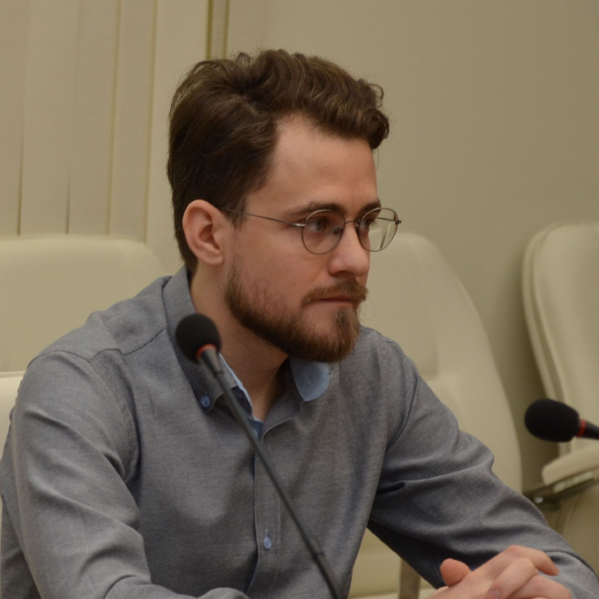

#   Melnichuk Dmitrii

### SKILLS

`Python` (`PyTorch`, `Keras`, `TensorFlow`, `Scikit-learn`, `Streamlit`, `Pandas`) 
`R` (`tsibble`, `anomalize`, `shiny`, `ggplot2`)
`SQL`, `MongoDB`
`Docker`, `Jenkins`, `Postman`, `Linux(bash)`, `Git`
`Microsoft Excel`, `Tableau`
`JavaScript`(`highcharts`, `D3`), `HTML`, `CSS`, `LaTeX`

### WORK EXPERIENCE

**Startups (clients: England, Canada)**   Sep 2021 to present
·   Market analysis and evaluation (`Python` and `R`)
·   Gathering functional requirements for web service development
·   Development of crypto indicators and realization in charts (`highcharts`)
·   Visualization of analytics (`Tableau`)
·   Prototyping a web application (`Streamlit`, `plotly`)

 

**SARATOV STATE UNIVERSITY**    Jan 2019 to present
Assistant. Department of Functions and Approximations Theory.
·   Deep Learning (lections and practice)
·   Machine Learning (lections and practice)
·   Data analysis with R (lections and practice)
·   Computer science and c++ programming (practice)

**BLOG - Portfolio**
·   
·   Easy-to-use view mode of the author's course (`HTML`, `CSS`, `JavaScript`)
·   

### EDUCATION

**SARATOV STATE UNIVERSITY**    2017 - 2022
*Ph.D.* Faculty of Computer Science and Information Technologies. 

**SARATOV STATE UNIVERSITY**    2015 - 2017
*M.Sc.* Faculty of Computer Science and Information Technologies. 
Applied mathematics and informatics

**SARATOV STATE UNIVERSITY**    2011 - 2015
*B.Sc.* Faculty of Computer Science and Information Technologies. 
Mathematical support and administration of information systems

### LANGUAGES

Russian: Native Language
English: Intermediate

### CONTACTS

E-MAIL: mlnchkdv@gmail.com
LN: [in/meldm/](https://www.linkedin.com/in/meldm/)
GH: [mlnchkdv](https://github.com/mlnchkdv)

[Google Scholar](https://scholar.google.com/citations?user=XcYTbJsAAAAJ&hl=en) 
[ResearchGate](https://www.researchgate.net/profile/Dmitriy-Melnichuk?ev=hdr_xprf)

[pfd version](./MelnichukDmitrii_CV.pdf)
2022

