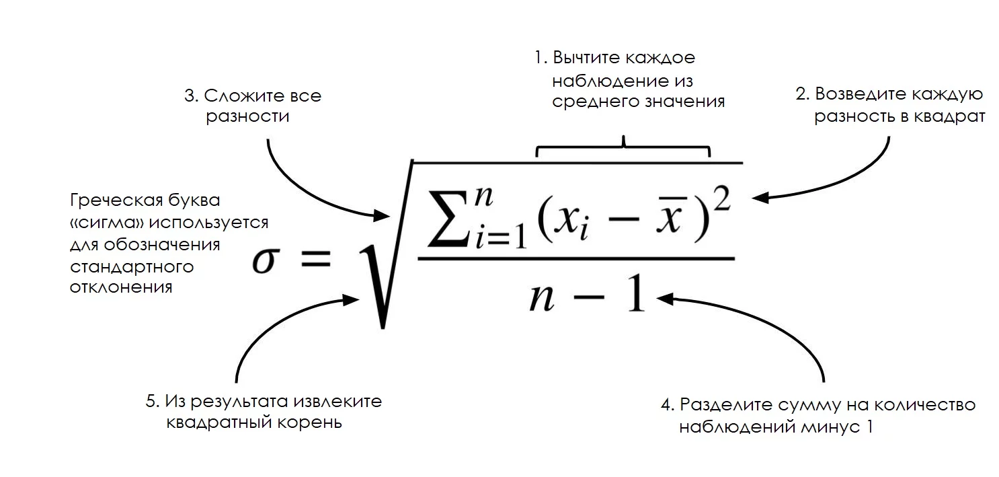
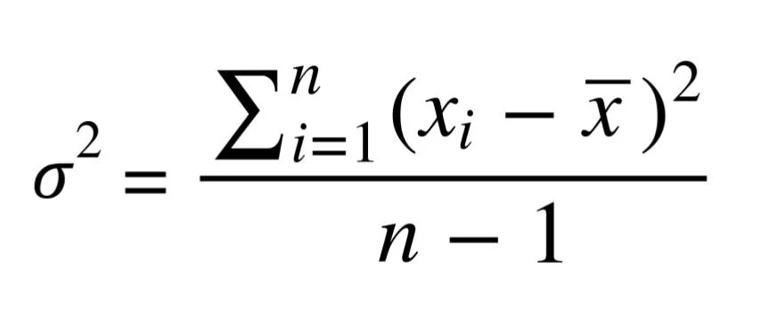
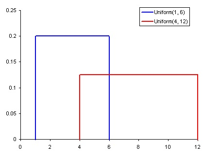
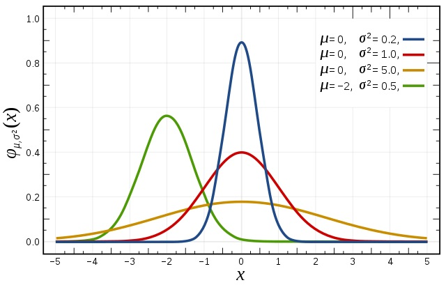
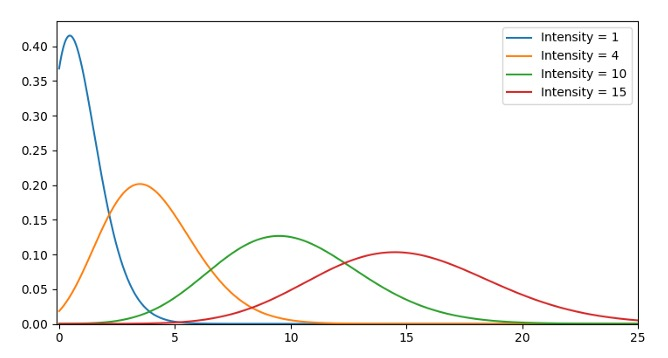

# Статистика и R

[TOC]

## Меры

### Меры центральной тенденции

**Меры центральной тенденции** — показатели, представляющие собой ответ на вопрос: «На что похожа середина данных?». Но слово «середина» может быть рассчитана с учетом разных свойств данных.

#### Среднее значение

Среднее значение (*mean*) — сумма всех значений признака, деленная на количесвто измерений. Среднее значение отражает типичный показатель в наборе данных. Если мы случайно выберем один из показателей, то, скорее всего, получим значение, близкое к среднему.
$$
\bar{x} = \frac{\sum_{i=1}^{n}x_i}{n}
$$

```python
# Python
# numpy для генератора случайных чисел
import numpy as np

x = np.random.normal(0, 1, 9)

avg_x = sum(x)/len(x)
# или
avg_x = x.mean()
```

```R
# R
x <- rnorm(10)
mean(x)

x <- c(2, 1, 2, 3, 1, NA, 3, 4)
# удаляет пропущенные значения
mean(x, na.rm = TRUE)
```

Есть также другие виды средних: среднее взвешенное и среднее усеченное.


#### Медиана

Медиана (*median*), как и среднее значение, нужна для определения типичного значения в наборе данных, но при этом в меньшей степени учитывая выбросы.

Чтобы найти медиану, данные нужно расположить в порядке возрастания. Медианой будет значение, которое совпадает с серединой набора данных. Если количество значений чётное, то берётся среднее двух значений, которые «окружают» середину.

```python
# Python
import numpy as np
x = np.random.normal(0, 1, 9)

# находим количество
length_x  = len(x)

# сортируем в порядке возрастания
sorted_x = sorted(x)

# ищем индекс среднего элемента
middle = (length_x / 2) + 0.5

# находим медиану
print(sorted_x[middle])

# или
import statistics

statistics.median(x)
```

```R
# R
x <- rnorm(10)
median(x)
```


#### Мода

Мода (*mode*) определяет значение, которое наиболее часто встречается в наборе данных. Таким образом, мода показывает наиболее значимый фактор, формирующий среднее значение.

```python
# Python
from statistics import mode
mode([1, 1, 2, 3, 3, 3, 3, 4])
```

```R
# R
getmode <- function(v) {
   uniqv <- unique(v)
   uniqv[which.max(tabulate(match(v, uniqv)))]
}
getmode(c(2, 1, 2, 3, 1, 2, 3, 4))
```


### Меры изменчивости

Меры изменчивости или меры разброса отвечают на вопрос: «Как сильно варьируются мои данные?».


#### Размах

Размах (*Range*) — разность максимального и минимального (крайние) значения.

```python
# Python
x = [1, 1, 2, 3, 3, 3, 3, 4]
range = max(x) - min(x)
```

```R
# R
x <- rnorm(10)
range <- max(x) - min(x)
```

Узнать, как сильно данные отличаются от типичного значения. Здесь нам помогут стандартное отклонение и дисперсия случайной величины.


#### Математическое ожидание

Математическое ожидание (*Expected value*) — среднее значение случайной величины, полученное при бесконечном числе испытаний, в результате которых она определяется, или по выборке бесконечного размера.
$$
1
$$

```R

```


#### Стандартное отклонение

Стандартное (cреднеквадратичное) отклонение (*standard deviation*) тоже является мерой разброса данных. Оно помогает узнать, как сильно данные отличаются от типичного значения. Иными словами, оно говорит о том, как сильно данные отличаются от среднего арифметического. Отношение к среднему арифметическому хорошо видно при расчёте отклонения:



Поговорим немного о строении уравнения. Как вы помните, среднее арифметическое рассчитывается путём сложения всех значений и деления на их количество. Уравнение стандартного отклонения похоже, но используется, чтобы найти, на сколько в среднем значения отклоняются от типичного, и включает дополнительную операцию с извлечением корня.

В некоторых источниках можно увидеть в качестве знаменателя `n` вместо `n-1`. Такие детали выходят за рамки нашей статьи, но знайте, что использование `n-1` считается более корректным. Подробное объяснение можно найти [здесь](https://math.stackexchange.com/questions/61251/intuitive-explanation-of-bessels-correction). 

> Этот результат называется стандартным отклонением на основании несмещённой оценки дисперсии. Деление на `n-1` вместо `n` даёт неискажённую оценку дисперсии для больших генеральных совокупностей.

Мы хотим посчитать стандартное отклонение, чтобы более полно описать цены вин и их оценки, поэтому напишем свою функцию. Поиск кумулятивной суммы вручную выглядел бы довольно громоздко, но циклы `for` в Python всё упрощают. Мы пишем свою функцию, чтобы показать, что на Python легко заниматься такой статистикой. Тем не менее в библиотеке `numpy` тоже реализовано вычисление стандартного отклонения через функцию `std`: 


#### Дисперсия

Часто стандартное отклонение и дисперсию связывают вместе и делают это не без причины. Вот уравнение дисперсии, ничего не напоминает?



Дисперсия и стандартное отклонение — почти одно и то же! Дисперсия — просто квадрат стандартного отклонения. Более того, обе величины отражают одну и ту же вещь — меру разброса, хотя стоит отметить, что единицы измерения разные. В каких бы единицах ни измерялись ваши данные, единицы измерения отклонения будут такими же, а у дисперсии они будут возведены в квадрат.

Многие новички в статистике задают вопрос: «Зачем возводить отклонение в квадрат? Разве нельзя избавится от отрицательных слагаемых при помощи модуля?». Избавление от отрицательных значений — хорошая причина для возведения в квадрат, но не единственная. Как и на среднее значение, на дисперсию и стандартное отклонение влияют выбросы. Очень часто нас интересуют выбросы, поэтому возведение в квадрат позволяет выделить эту особенность. Если вы знакомы с математическим анализом, то поймете, что наличие экспоненциального выражения позволяет найти точку минимального отклонения.

Чаще всего при статистическом анализе нам понадобятся только среднее значение и стандартное отклонение, однако дисперсия по-прежнему важна в других академических областях. Меры центральной тенденции и разброса позволяют нам систематизировать данные и извлечь из них знания.


## Распределения

Распределения вероятностей

Вероятность можно определить как процентный шанс того, что какое-то событие произойдёт. В Data Science вероятность находится в пределах от 0 до 1, где 0 означает, что событие точно не произойдёт, а 1 — что точно произойдёт. Распределение вероятностей — это функция, которая отображает вероятности всех возможных значений. Рассмотрим основные виды распределений. Но прежде рассмотрим еще одну базовую концепцию, статистические характеристики.

### Статистические характеристики 

Статистические характеристики (квантили распределения) — наверное, наиболее часто используемая статистическая концепция в Data Science. Обычно это первое, что применяют при исследовании набора данных. В эту концепцию входят такие понятия как отклонение, дисперсия, среднее значение, медиана, процентили и многие другие. Их довольно легко понять и реализовать в коде:


Линия посередине — это медианное значение данных. Медиану используют вместо среднего значения по той причине, что она более устойчива к аномальным значениям в данных. Первый квартиль — это 25 процентиль, т.е. 25% значений в данных находятся ниже этого значения. Третий квартиль — это 75 процентиль, т.е. 75% значений в данных находятся ниже этого значения. Минимальное и максимальное значения отражают нижнюю и верхнюю границы диапазона данных.

[Ящик с усами](https://ru.wikipedia.org/wiki/Ящик_с_усами) прекрасно демонстрирует, что мы можем сделать с основными статистическими характеристиками:

- Когда этот ящик короткий, то можно сделать вывод, что большинство значений в данных похожи, так как много значений находится на небольшом расстоянии друг от друга.
- Когда ящик длинный, то можно сделать обратный вывод: большинство значений отличаются друг от друга.
- Если медианное значение ближе к низу, то можно сказать, что большая часть данных имеет более низкие значения. Если оно ближе к верху, то большая часть данных имеет более высокие значения. По сути, если медиана не находится по центру ящика, то это показатель того, что данные неравномерны.
- Усы очень длинные? Значит, данные имеют высокое стандартное отклонение и дисперсию, т.е. значения сильно разбросаны и отличаются друг от друга. Если усы длинные только с одной стороны ящика, то, возможно, данные заметно изменяются только в одном направлении.

Используйте статистические характеристики для быстрой, но при этом информативной оценки ваших данных.

### Равномерное распределение

**Равномерное распределение** — самое базовое из представленных здесь. У него есть единственное значение, которое встречается только в определённом диапазоне, а всё, что находится за его пределами, равно нулю. Это распределение можно воспринимать как признак категориальной переменной с двумя категориями: 0 и значением. У такой переменной могут быть и другие значения, отличные от нуля, но это не мешает изобразить её в виде функции, состоящей из нескольких равномерных распределений.



### Нормальное распределение

**Нормальное распределение** или распределение Гаусса определяется медианой и стандартным отклонением. Медиана сдвигает распределение в пространстве, а отклонение влияет на масштаб. Важное отличие этого распределения от других заключается в том, что стандартное отклонение одинаково во всех направлениях. Таким образом, с распределением Гаусса чётко видно среднее значение в наборе данных. Также становится наглядным распределение данных, т.е. распределены ли они на большом промежутке или же сконцентрированы вокруг нескольких значений.



**Нормальное распределение (*Normal distribution*)** отвечает следующим требованиям: 

*Унимодальное* - распределение, имеющее только одну моду (т.е. один "пик").

*Симметричное* - распределение, плотность которого симметрична относительно центральной точки (среднего). т.е. значение данных с одной и с другой стороны являются "зеркальным отображением" друг друга. Для симметричных унимодальных распределений мода, медиана и среднее совпадают.

Отклонения наблюдений от среднего подчиняются *определенному вероятностному закону*. Правило $3\sigma$ (сигм) (3-sigma rule) - практически все значения нормально распределённой случайной величины лежат в интервале $\left( \bar{x}-3 \sigma ; \bar{x}+3 \sigma \right)$, т.е. приблизительно с вероятностью 0,9973 значение нормально распределённой случайной величины лежит в указанном интервале.
Другое определение правила, утверждает, что вероятность того, что случайная величина отклонится от своего математического ожидания более, чем на три среднеквадратических отклонения, практически равна нулю. Правило справедливо только для случайных величин, 	распределенных по нормальному закону.
*Математическое ожидание (Expectation value)* - среднее значение случайной величины, полученное при бесконечном числе испытаний, в результате которых она определяется, или по выборке бесконечного размера.


#### Z-преобразование

Стандартизация (Z-преобразование, Z-стандартизация) - приведение данных в стандартную Z-шкалу(Z-scores) со средним $\mu /  \bar{x} = 0$ и стандартным отклонением  $\sigma / sd_x= 1$. 
Для этого нам потребуется из каждого наблюдения в выборке отнять среднее данной выборки $x_i - \bar{x}$. Таким образом мы получим набор данных состоящий из положительных и отрицательных чисел и возможен также $0$ в случае, если среднее значение выборки включено в саму выборку $\bar{x} - \bar{x} = 0$. Возведем в квадрат каждое число из данного набора данных и сложим. Теперь вычислим дисперсию разделив данное число на $n-1$ (где $n$ число элементов в выборке). Зная дисперсия, мы можем вычислить стандартное отклонение через $\sigma / sd_x = \sqrt{D}$.

> Дисперсия характеризует меру разброса чисел выборки относительно среднего значения.
> Стандартное отклонение – это величина, которая определяет разброс чисел выборки.

Z-оценка позволяет определить количество стандартных отклонений от среднего значения. В результате общая формула выглядит так $z_i = \frac{x_i - \bar{x}}{sd_x}$ 

#### Центральная предельная теорема

Предположим исследуемый признак имеет нормальное распределение в генеральной совокупности (с некоторым средним и стандартным отклонением) и мы извлекаем выборки равные $n$ по объему и в каждой выборке рассчитываем среднее и строим распределение этих выборочных средних. И такое распределение будет являться нормальным со средним равным как в генеральной совокупности и стандартным отклонением $se=\frac{\sigma}{\sqrt n}=\frac{sd_x}{\sqrt n}$, которое еще называется ***стандартной ошибкой среднего распределения***, и показывает на сколько в среднем выборочные значения отклоняются от среднего в генеральной совокупности.

Следовательно, чем больше элементов (наблюдений) в выборке, тем ближе все выборочные средние к реальному среднему в генеральной совокупности. Поэтому изменчивость всех средних будет тем меньше чем больше элементов в генеральной совокупности. 

#### Статистический вывод


### Распределение Пуассона

**Распределение Пуассона** похоже на нормальное, но с дополнительным коэффициентом асимметрии. При низком коэффициенте значения распределены относительно равномерно во все стороны, как при нормальном распределении. Если же он высокий, то распределение данных будет разным в разных направлениях — в одном данные будут сильно распределены, а в другом — сильно сконцентрированы.



Существует гораздо больше распределений, но этих трёх достаточно для понимания основ. С помощью равномерного распределения можно быстро рассмотреть и интерпретировать категориальные переменные. При нормальном распределении существует много алгоритмов, которые по умолчанию хорошо работают с этим распределением. При распределении Пуассона нужно внимательно подойти к выбору алгоритма, потому что он должен быть устойчив к изменениям в пространственном распределении.

## Ключевые идеи

- описательная статистика используется для систематизации и количественного описания данных;
- среднее значение указывает на типичное значение в нашем наборе данных. Оно не робастно;
- медиана является центральным значением в ряду данных. Она робастна;
- мода — значение, которое появляется наиболее часто;
- размах — это разность между максимальным и минимальным значениями в наборе данных;
- дисперсия и стандартное отклонение являются средним расстоянием от среднего арифметического значения.


Добавить про распределения и статистичекий вывод + темы из статистика и котика.


