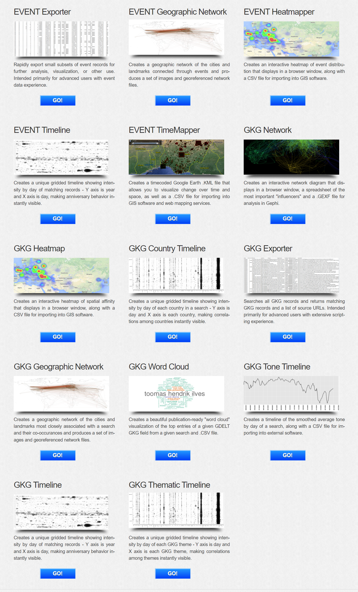
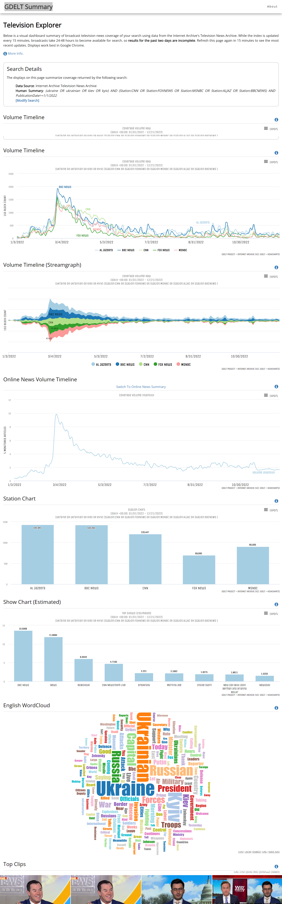
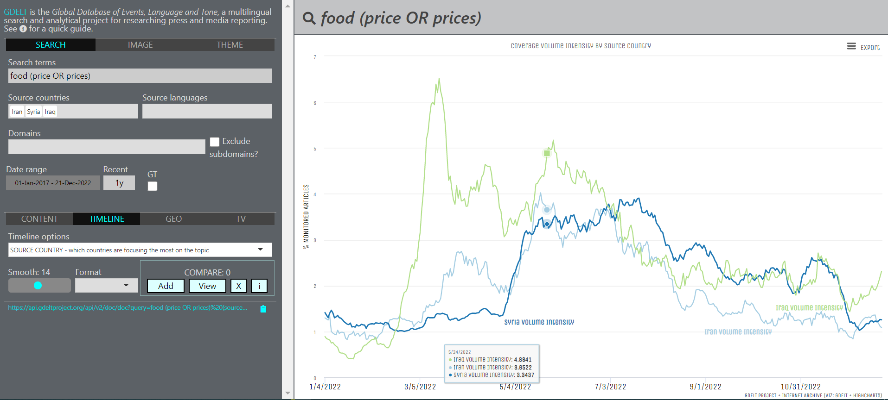

# GDELT review

[TOC]


## What is GDELT


​			[GDELT](https://www.gdeltproject.org/) или ==Global Database of Events, Language, and Tone==, создан Калевом Летару ([Kalev H. Leetaru](https://www.kalevleetaru.com/)) из Yahoo! и Джорджтаунским университетом, характеризуют проект как – каталог поведения и убеждений общества во всех странах мира, с ежедневной фиксацией событий [1]. Ранние исследования, лежащие в основе GDELT, были сформулированы на конференции в январе 2011 года. Набор данных доступен на облачной платформе Google.

> Проект GDELT – это открытая платформа для исследований и анализа глобального общества, и все наборы данных в рамках проекта GDELT, доступны для неограниченного использования в любых академических, коммерческих или правительственных целях любого рода и [без платы](https://www.gdeltproject.org/about.html#termsofuse).


​			Проект GDELT возник из желания лучше понять глобальное человеческое общество и особенно ==связь между коммуникативным дискурсом и физическим поведением в масштабах общества==. Видение проекта GDELT заключается в ==кодификации всей планеты в вычисляемом формате== с использованием всех доступных открытых источников информации, что обеспечивает новую платформу для понимания глобального мира.


​			На момент 2018 года проект GDELT состоял из более чем ==четверти миллиарда записей о событиях в более чем 300 категориях, охватывающих весь мир с 1979 года по настоящее время==, наряду с масштабной сетевой диаграммой, соединяющей каждого человека, организацию, местоположение, тему и эмоции. Только в 2015 году было получено более трех четвертей из триллиона эмоциональных оценок и более 1.5 миллиарда ссылок на местоположение, а всего за первую половину 2016 года было обработано более 70 миллионов изображений. Видение GDELT состоит в том, чтобы использовать эти данные для создания каталога поведения и убеждений людей в масштабах общества во всех странах мира, объединяя каждого человека, организацию, местоположение, количество, тему, источник новостей и событие по всей планете в единую массивную сеть, которая фиксирует происходящее по всему миру, каков его контекст и кто в нем участвует, и как мир относится к этому каждый день.



​			==У GDELT есть несколько сервисов==. Сам GDELT – это источник данных, а [GDELT Analytical Services](https://analysis.gdeltproject.org/) [3] – инструменты для работы с этими данными. Данные инструменты и данные можно разделить на два формата, это ==табличные данные EVENT и графовые модели GKG== (Global Knowledge Graph).

> Данный набор инструментов находится на стадии обновления, как следует из оффициальных источников (2022).

- [EVENT Exporter](https://analysis.gdeltproject.org/module-event-exporter.html) – экспорт подмножеств записей о событиях для дальнейшего анализа, визуализации или другого использования. Один из самых старых интсрументов проекта (2013). Доступ возможен при помощи Google Big Query и Email.
- [EVENT Geographic Network](https://analysis.gdeltproject.org/module-event-geonet.html) – создает географическую сеть городов и достопримечательностей, связанных через события, и производит набор изображений и файлов сети с географической привязкой. Доступ возможен при помощи Google Big Query и Email.
- [EVENT Heatmapper](https://analysis.gdeltproject.org/module-event-heatmapper.html) – создает интерактивную тепловую карту распределения событий. Доступ возможен при помощи Google Big Query и Email.
- [EVENT Timeline](https://analysis.gdeltproject.org/module-event-timeline.html) – создает уникальную временную шкалу с сеткой, показывающую интенсивность по дням совпадающих записей, где по оси $Y$ – год, а ось $X$ – день, что мгновенно показывате повторяющиеся события. Доступ возможен при помощи Google Big Query и Email.
- [EVENT TimeMapper](https://analysis.gdeltproject.org/module-event-timemapper.html) – создает кодированный по времени файлы для картографических веб-сервисов, таких как Google Earth и GIS. Доступ возможен при помощи Google Big Query и Email.
- [GKG Network](https://analysis.gdeltproject.org/module-gkg-network.html) – создает интерактивную сетевую диаграмму, данные содержат наиболее важные и влиятельные субъекты (*influencers*) в формате для анализа в Gephi. Доступ возможен при помощи ==???== и Email.
- [GKG Heatmap](https://analysis.gdeltproject.org/module-gkg-heatmapper.html) – создает интерактивную тепловую карту пространственной близости. Доступ возможен при помощи ==???== и Email.
- [GKG Country Timeline](https://analysis.gdeltproject.org/module-gkg-countrytimeline.html) – создает сетчатую временную шкалу, показывающую интенсивность по дням для каждой страны в поиске, по оси $Y$ - день, а ось $X$ - каждая страна, что позволяет мгновенно увидеть корреляцию между странами. Доступ возможен при помощи ==???== и Email.
- [GKG Exporter](https://analysis.gdeltproject.org/module-gkg-exporter.html) – выполняет поиск всех записей GKG и возвращает совпадающие записи GKG и список URL-адресов источников. Доступ возможен при помощи ==???== и Email.
- [GKG Geographic Network](https://analysis.gdeltproject.org/module-gkg-geonet.html) – создает географическую сеть из городов и достопримечательностей, наиболее тесно связанных с поиском, и их совместных совпадений, и производит набор изображений и файлов сети с географической привязкой. Доступ возможен при помощи ==???== и Email.
- [GKG Word Cloud](https://analysis.gdeltproject.org/module-gkg-wordcloud.html) – создает облако слов, готовое к публикации. Доступ возможен при помощи ==???== и Email.
- [GKG Tone Timeline](https://analysis.gdeltproject.org/module-gkg-tonetimeline.html) – создает временную шкалу сглаженного среднего тона по дням для поиска.
- [GKG Timeline](https://analysis.gdeltproject.org/module-gkg-timeline.html) – создает временную шкалу с привязкой к сетке, показывающую интенсивность совпадающих записей по дням, где $Y$ - год, а ось $X$ - день, что мгновенно показывате повторяющиеся события.
- [GKG Thematic Timeline](https://analysis.gdeltproject.org/module-gkg-thematictimeline.html) – создает сетчатую временную шкалу, показывающую интенсивность по дням каждой темы для GKG, где ось $Y$ - день, а ось $X$ - каждая тема GKG, что позволяет мгновенно увидеть корреляцию между темами.

> Одна из самых популярных [статей](./analiz-bolshih-obemov-dannyh-vozmozhnosti-gdelt-project-pri-ispolzovanii-yazyka-programmirovaniya-python-opyt-gumanitariya-reshivshego-postich-big-data.pdf) (2021) на русском языке [13] описывает вариант взаимодействия с GDELT при помощи SQL-запросов и Google BigQuery на базе Google Cloud Platform и не раскрывает всех возможностей нативных инструментов из набора GDELT Analytical Services.


​			В [блоге проекта](https://blog.gdeltproject.org/ukraine-doesnt-recapture-media-attention-despite-battlefield-successes/) [2] часто выходят короткие и актуальные исследования сгенерированные на базе ещё одного инструмента [GDELT Summary](https://api.gdeltproject.org/api/v2/summary/summary?d=iatv) [5] (комбинация инструментов из GDELT Analytical Services), а также новости проекта и [документация](https://blog.gdeltproject.org/?s=api) с примерами URL-запросов. Ниже представлен пример URL-запроса для одного из последних исследований на базе GDELT Summary:

https://api.gdeltproject.org/api/v2/summary/summary?d=iatv&t=summary&k=%28ukraine+OR+ukrainian+OR+kiev+OR+kyiv%29&ts=custom&sdt=20220101000000&fs=station%3ACNN&fs=station%3AFOXNEWS&fs=station%3AMSNBC&fs=station%3AALJAZ&fs=station%3ABBCNEWS&fdn=raw&fts=3&svt=zoom&svts=zoom&swvt=zoom&ssc=yes&sshc=yes&swc=yes&stcl=yes&c=1

*(ukraine OR ukrainian OR kiev OR kyiv) AND (Station:CNN OR Station:FOXNEWS OR Station:MSNBC OR Station:ALJAZ OR Station:BBCNEWS) AND PublicationDate>=1/1/2022*




## How to use GDELT

​			Взаимодействие с GDELT и его подпроектами возможно при помощи URL-запросов с параметрами. У каждого параметра есть список операторов, которые могут быть использованы в качестве значения этого параметра. []

> [Видео](https://www.youtube.com/watch?v=kzzQxlk9bBY) с подключением и выгрузкой данных в MongoDB [16] данных из GDELT EVENT (2022).
>
> Также на оффициальном канале автора проекта [youtube.com/@gdeltproject529](https://www.youtube.com/@gdeltproject529) разбираются технические аспекты работы с данными, например [поиск настроений с помощью BigQuery в GDELT](https://www.youtube.com/watch?v=UHc3Gsvz2Ss). Однако некоторые видео устарели в виду развития проекта и используемых технологий и зачастую дублируют материалы блога.


### gdelt.github.io

​			Сайт [gdelt.github.io](https://gdelt.github.io/) [3] не связан с GDELT ([gdeltproject.org](gdeltproject.org)), но предоставляет интерфейс к некоторым из его сервисов и данным – в частности, к api Doc, Geo и Television. Этот проект ==не следует путать с базами данных GDELT EVENT==. С помощью этого проекта можно:

- поиск на английском языке глобального контента в любой или всех языкых группах по определенной теме;
- поиск конкретного контента или опубликованных за последний час, день, неделя и т.д. материалов (например Япония, или на японском языке, или со ссылкой на японское местоположение);
- находить контент на основе характеристик и текста в его изображениях;
- исследовать и сравнивать тенденции развития СМИ во времени.

Рассматрим форматы взаимодействия с данным проектом.


#### Режим запросов

- **Поисковой запрос** (*Search term*) – используются слова и фразы на Анлийском языке, даже в случае поиска контента не связанного с английским языком, будет автоматически переведен с английского на исходные языки (*source languages*). Фразы следует заключать в "двойные кавычки". Spaces outside quotes are interpreted as AND. Boolean is supported, so you can search for  ['(x OR y)'](https://gdelt.github.io/#api=geo&query=(missile OR nuclear)&geolocationcc=KN&geomode=PointData&geotimespan=7d) or ['x -y' (NOT y)](https://gdelt.github.io/#api=doc&query="World Cup" -football&sourcelang=eng&contentmode=ArtList&maxrecords=75&timespan=1m). There are also two powerful special search functions that can help to find the right content:
    - **near:** articles that feature two words within *n* words of each other - e.g. **near5:"climate emergency"** [(example)](https://gdelt.github.io/#api=doc&query=near5:"climate emergency"&timelinemode=TimelineVol&timelinesmooth=0&timespan=1w)
    - **repeat:** articles that feature a word a minimum of *n* times (max 5) - e.g. **repeat3:"climate"** [(example)](https://gdelt.github.io/#api=doc&query=repeat3:"climate"&contentmode=ArtList&maxrecords=75&timespan=1w)
- **Image tags** - images within content are processed using deep learning algorithms to identify features and text they contain. Search for available tags in the dialogue box ([example](https://gdelt.github.io/#api=doc&query=&imagetag=military vehicle,tank,self propelled artillery&sourcecountry=UP&contentmode=ImageCollageInfo&maxrecords=75&timespan=1w))
- **Themes** - content is interpreted and linked to 'themes' reflecting its subject matter, which you can search by. Themes are based on GDELT's [Global Knowledge Graph](https://blog.gdeltproject.org/gdelt-global-knowledge-graph/) (GKG).
- **Source countries** - countries of content origin. Choose up to ~7 - current implementation interprets these as (tag1 OR tag2)
- **Source languages** - languages of the content. Choose up to ~7 - currently interpreted as (theme1 OR theme2)
- **Domain** - define web domain of content - e.g. 'bbc.co.uk' or top-level domain '.gov' (US government content). Currently supports up to 5 domains, or 7 with _Exclude subdomains_ checked.
- **Date range** - define any window for content dated since 1 January 2017. 'Recent' field must be clear to use this. CONTENT view will only return matching articles published in the most recent 3 months of your specified window.
- **Recent** - set to return most recent content in terms of minutes/hours/days/months/year. Use format '12h', '5d', '3w', '6m', '1y' (1y max) or just a number for minutes.
- **GT** - A Google Translate widget to translate articles headlines in ART LIST and ART GALLERY modes. To use scroll to the bottom of the results window and select the target language. Translations of abbreviated headlines aren't always very good, but should still give an idea of topic.


#### Режим анализа

- **CONTENT** – This tab offers the various modes to access the content matching the search ([example1](https://gdelt.github.io/#api=doc&query=Essequibo Venezuela (border OR claim OR territory OR territorial)&sourcecountry=GY&contentmode=ArtList&maxrecords=75&timespan=1y) )
- **TIMELINE** – This offers the modes available to view volumetric trends for the query over time ([example1](https://gdelt.github.io/#api=doc&query=(Essequibo OR Esequiba)&sourcecountry=VE,GY&timelinemode=TimelineSourceCountry&timelinesmooth=14&timespan=1y), [example2](https://gdelt.github.io/#api=doc&query=(Essequibo OR Esequiba)&sourcecountry=-US&sourcelang=spa,eng&timelinemode=TimelineLang&timelinesmooth=14&timespan=1y)).
- **GEO** – Geographical tools to investigate media published in the past 7 days. Some modes (e.g. default POINT DATA [example](https://gdelt.github.io/#api=geo&query=(refugees OR migrants) (boat OR ship)&geolocationcc=AG,LY,TS,MO,LE,EG&geomode=PointData&geotimespan=7d)) report not the origins of content, but countries and place names that are referenced. Some of the modes are image-specific, and will only work for image tag searches. Others work only with search terms and not image tags.
- **TV** – This explores GDELT's Television Explorer API, a collaboration with the Internet Archive to make searchable the "closed captioning" text streams accompanying TV news - i.e. the digitised speech that is broadcast - for selected networks.


#### Режим сравнения

​			Данный инструмент запоминает данные для запросов временной шкалы (*timeline*), при нажатии книпки *Add*, и сравненивает их после запуска кнопки *View*.

​			Режим объема временной шкалы (*timeline volume modes*) GDELT расчитывает долю глобального медиаконтента, который соответствует запросу (однако запрос определяется в терминах ключевых слов / фраз (*keywords*/*phrases*), фильтров страны / языка (*country*/*language filters*), тегов изображений (*imagetags*) и т.д.). При добавлении фильтра (например, страна-источник (*source-country*) = France или язык (*language*) = French) в качестве результата будет показана доля глобального контента (*proportion of global content*). Языковой режим временной шкалы (*timeline language mode*) GDELT сообщает о доле носителей на том языке, который соответствует запросу. Аналогично режим страны источника (*source country mode*) сообщает о доле носителей, происходящих из этой страны, которая соответствует запросу.



​			Если необходимо провести [сравнение между странами по одной и той же фразе или слову](https://gdelt.github.io/#api=doc&query=food%20(price%20OR%20prices)&sourcecountry=IR,SY,IZ&timelinemode=TimelineSourceCountry&timelinesmooth=14&timespan=1y) (например: цены на продукты питания – food prices), то необходимо использовать режим исходной страны (*source country mode*), а не инструмент сравнения (*compare*). Аналогично и для простого сравнения языков и языкового режима. Для [сравнения пропорции глобального контента](https://gdelt.github.io/#compare&Iran%20(food%20prices)=https%3A%2F%2Fapi.gdeltproject.org%2Fapi%2Fv2%2Fdoc%2Fdoc%3Fquery%3Dfood%20(price%20OR%20prices)%2520sourcecountry%3AIR%26mode%3DTimelineVol%26timelinesmooth%3D5%26timespan%3D1y%26format%3Djson&Iraq%20(food%20prices)=https%3A%2F%2Fapi.gdeltproject.org%2Fapi%2Fv2%2Fdoc%2Fdoc%3Fquery%3Dfood%20(price%20OR%20prices)%2520sourcecountry%3AIZ%26mode%3DTimelineVol%26timelinesmooth%3D5%26timespan%3D1y%26format%3Djson&Syria%20(food%20prices)=https%3A%2F%2Fapi.gdeltproject.org%2Fapi%2Fv2%2Fdoc%2Fdoc%3Fquery%3Dfood%20(price%20OR%20prices)%2520sourcecountry%3ASY%26mode%3DTimelineVol%26timelinesmooth%3D5%26timespan%3D1y%26format%3Djson) (*compare proportions of global content*), используйте сравнения (*compare*) с отдельными запросами, определенными в режиме объем (*volume*).


Если нажать на Add:


В результате будут сгенерированы 3 URL запроса на получение графиков по отдельности для каждой страны (запрос ниже для Сирии):

https://api.gdeltproject.org/api/v2/doc/doc?query=food%20(price%20OR%20prices)%20sourcecountry:SY&mode=TimelineVol&timelinesmooth=5&timespan=1y&timezoom=yes

<iframe src="https://api.gdeltproject.org/api/v2/doc/doc?query=food%20(price%20OR%20prices)%20sourcecountry:SY&mode=TimelineVol&timelinesmooth=5&timespan=1y&timezoom=yes&FORMAT=html" scrolling="no" width=100% height=350px frameborder="0" class="respviz"></iframe>

> График выше интегрирован при помощи `iframe` и возможен экспорт во множество форматов.


## GDELT and frameworks

### gdelt-doc-api

​			[gdelt-doc-api](https://github.com/alex9smith/gdelt-doc-api) – клиент Python для доступа к данным из [api GDELT 2.0 Doc](https://blog.gdeltproject.org/gdelt-doc-2-0-api-debuts/) [12]. Проводит более простой, мелкомасштабный анализ новостных материалов, не сталкиваясь со сложностями загрузки и управления необработанными файлами из S3 или работы с экспортом BigQuery.

```python
# pip install gdeltdoc
from gdeltdoc import GdeltDoc, Filters

f = Filters(
    keyword = "climate change",
    start_date = "2020-05-10",
    end_date = "2020-05-11"
)

gd = GdeltDoc()

# Search for articles matching the filters
articles = gd.article_search(f)

# Get a timeline of the number of articles matching the filters
timeline = gd.timeline_search("timelinevol", f)
timeline
```

В качестве результата будет DataFrame:

```
                    datetime  Volume Intensity
0  2020-05-10 00:00:00+00:00            0.1839
1  2020-05-10 00:15:00+00:00            0.4375
2  2020-05-10 00:30:00+00:00            0.1273
3  2020-05-10 00:45:00+00:00            0.6582
4  2020-05-10 01:00:00+00:00            0.5048
..                       ...               ...
92 2020-05-10 23:00:00+00:00            0.5805
93 2020-05-10 23:15:00+00:00            0.2661
94 2020-05-10 23:30:00+00:00            0.6459
95 2020-05-10 23:45:00+00:00            0.4957
96 2020-05-11 00:00:00+00:00            0.2811

[97 rows x 2 columns]
```

​			Данная библиотека имеет подробную документацию к использованию, все функции актуальны.


### gdeltr2

​			[gdeltr2](https://github.com/abresler/gdeltr2) – клиент для доступа к базам данных GDELT на языке R [17]. Даже более обширный функционал чем у библиотеки выше. Подробная документация и обновляемый код проекта.


## References

[1] [gdeltproject.org](https://www.gdeltproject.org/) – сайт проекта.
[2] [blog.gdeltproject.org](https://blog.gdeltproject.org/) – блог проекта. 
[3] [analysis.gdeltproject.org](https://analysis.gdeltproject.org/) – набор инструментов и сервисов   для визуализации, исследования и экспорта данных из базы данных GDELT.
[4] [gdelt.github.io](https://gdelt.github.io/) – упрощенный web-интерфейс GDELT api.
[5] [api.gdeltproject.org/api/v2/summary](https://api.gdeltproject.org/api/v2/summary/summary?d=iatv) – web-интерфейс GDELT Summary. 
[6] [blog.gdeltproject.org/web-ngrams-3-0-tutorials-roundup](https://blog.gdeltproject.org/web-ngrams-3-0-tutorials-roundup/) – серия учебных пособий, демонстрирующих, возможности GDELT Web News NGrams 3.0. 
[7] [blog.gdeltproject.org/gdelt-doc-2-0-api-debuts](https://blog.gdeltproject.org/gdelt-doc-2-0-api-debuts/) – документация GDELT Doc.
[8] [blog.gdeltproject.org/gdelt-geo-2-0-api-debuts](https://blog.gdeltproject.org/gdelt-geo-2-0-api-debuts/) – документация GDELT Geo.
[9] [blog.gdeltproject.org/gdelt-2-0-television-api-debuts](https://blog.gdeltproject.org/gdelt-2-0-television-api-debuts/) – документация GDELT TV.
[10] [archive.org/details/tv](https://archive.org/details/tv) – архив телевизионных новостей. 
[11] [blog.gdeltproject.org/announcing-the-gdelt-context-2-0-api](https://blog.gdeltproject.org/announcing-the-gdelt-context-2-0-api/) – API Context c поддержкой до 72 часов скользящего окна.
[12] [github.com/alex9smith/gdelt-doc-api](https://github.com/alex9smith/gdelt-doc-api) – Python клиент для доступа к данным GDELT Doc.
[[13](https://cyberleninka.ru/article/n/analiz-bolshih-obemov-dannyh-vozmozhnosti-gdelt-project-pri-ispolzovanii-yazyka-programmirovaniya-python-opyt-gumanitariya)] *Ярцева Н. В. –  Анализ больших объемов данных: возможности GDELT project при использовании языка программирования Python. Опыт гуманитария, решившего постичь Big Data // Мониторинг. 2021. №1.*
[14] [habr.com/ru/post/224647](https://habr.com/ru/post/224647/) – одно из первых упоминаний о GDELT в российском сегменте (30 мая 2014).
[[15](https://swan-swan.ru/articles/nauka/banki-informacii-i-bazy-otkrytyh-dannyh-opyt-gdelt/)] Перевод оригинальной статьи [Forbs](https://www.forbes.com/sites/kalevleetaru/2018/11/24/seeing-the-world-through-the-eyes-of-others-mass-machine-translation/?sh=4b33cb542c8a) о возможностях GDELT после большого обновления (24 ноября 2018).
[16] [github.com/jdrumgoole/gdelttools](https://github.com/jdrumgoole/gdelttools) –  инструмент для загрузки данных из GDELT в MongoDB, доступен под [Python](https://pypi.org/project/gdelttools/0.5a17/).
[17] [github.com/abresler/gdeltr2](https://github.com/abresler/gdeltr2) – клиент для доступа к базам GDELT на языке R.


[**↑ В начало**](#gdelt-review)

<div style="text-align: center;">mlnchk 2022</div>

<script>   
    document.querySelectorAll("img").forEach((item, index, arr) => {
        item.addEventListener("click", (event) => {
            event.target.requestFullscreen();
            document.addEventListener('keyup', (e) => {
                if (e.keyCode == '39') {
                    // right arrow
                    arr[index + 1].requestFullscreen();
                    item = arr[index + 1];
                    index++;
                } else if (e.keyCode == '37') {
                    // left arrow
                    arr[index - 1].requestFullscreen();
                    item = arr[index - 1];
                    index--;
                }
            });
        });
    });
</script>